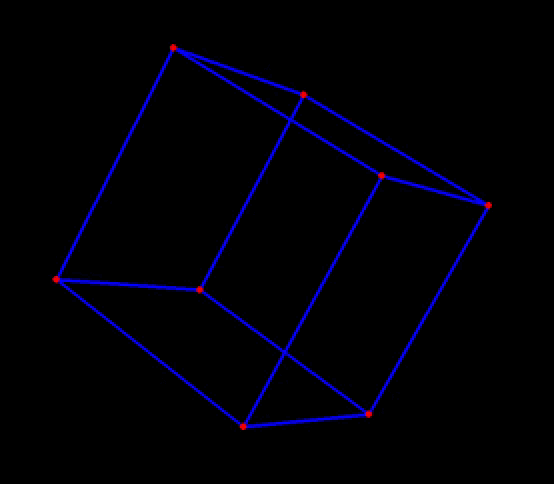
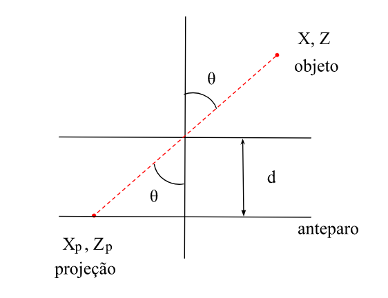

# Cubo 3D

APS 4 - Álgebra Linear e Teoria da Informação - 2021.1

## Integrantes do grupo
* [Isabelle da Silva Santos](https://github.com/isabelleatt)
* [Livia Tanaka](https://github.com/liviatanaka)

## Introdução

O "Cubo 3D" é um programa desenvolvido para a disciplina de Álgebra Linear e Teoria da Informação, ministrada pelo professor Tiago Fernandes Tavares. O modelo implementado é um modelo gráfico que consiste em um cubo no espaço tridimensional que pode ser rotacionado e projetado em uma cena bidimensional através de uma projeção perspectiva. O modelo foi implementado em Python utilizando a biblioteca Pygame para a renderização gráfica.

### Gif do Cubo 3D


* **Descrição:** Gif demonstrativo do Cubo 3D

## Descrição do projeto

### Instruções de Dowload
#### Clonando um Repositório
Primeiramente, verifique se o Python está instalado em sua máquina e navegue para o diretório aonde você gostaria de clonar o repositório usando comandos como:
*  cd: para mudar de diretório 
* cd ../ para voltar um nível do diretório <br>

Para clonar um repositório, siga as instruções em: <br>
"https://docs.github.com/pt/repositories/creating-and-managing-repositories/cloning-a-repository"


Para clonar o repositório pelo terminal, você pode usar o seguinte comando: <br>
```
    git clone https://github.com/liviatanaka/cubo3D.git
```

Agora, você poderá acessar os arquivos recém baixados com os comandos *cd* e *ls*

#### Instalando o necessário
É necessário realizar algumas breves instalações para utilizar o código, isso pode ser realizada de forma simples usando o comando: <br>
```
    pip install pygame, numpy
```

#### Rodando o programa
Para rodar o programa é necessário executar o arquivo main.py, podendo o mesmo ser realizado pela ferramente no topo superior direito do Visual Studio code ou usando o seguinte comando: <br>
```
    python main.py
```

O modelo permite a rotação e a projeção do cubo em tempo real por meio de interações do usuário com o teclado e a tela. As interações do usuário são implementadas em um loop principal que chama o método de rotação e o método de projeção repetidamente, produzindo a ilusão de movimento do cubo em tempo real. O usuário pode interagir com o programa por meio das seguintes teclas:  <br>

| Tecla | Comando |
| --- | --- | 
| w | Rotação em torno do eixo x positivo |
| s | Rotação em torno do eixo x negativo |
| a | Rotação em torno do eixo y positivo |
| d | Rotação em torno do eixo y negativo |
| q | Rotação em torno do eixo z positivo |
| e | Rotação em torno do eixo z negativo |
| 1 | Modo que possibilita a rotação automática do cubo |
| 2 | Modo que possibilita a rotação controlada do cubo |
| Scroll para cima | Aumenta a distância focal |
| Scroll para baixo | Diminui a distância focal |

## Projeção do cubo 3D em duas dimensões

Para realizar a projeção de um objeto de três dimensões em um de apenas duas, é preciso descobrir os pontos $X_p$ e $Y_p$ correspondentes a cada uma das coordenas $(X, Y, Z)$ que, no caso, são os vértices do cubo.


* $(X,Z)$ → coordenadas originais do objeto
* $(X_p, Z_p)$ → coordenadas da projeção do ponto $(X, P)$
* $d$ → distância focal

Na imagem acima foi considerado que o plano y está fixo para poder visualizar a projeção dos pontos $X$ e $Z$ no anteparo. Nessas condições é possível calcular o Xp e o Zp da seguinte forma:

1. Como $d$ é a distância entre o eixo x e o anteparo e a coordenada $Z_p$ está em cima do anteparo,

$$
Z_p = - d
$$

2. Tendo em vista que o ângulo $\theta$ é o mesmo de ambos os lados, já que são opostos pelo véritce, é possível aplicar a semelhança de triângulos para descobrir o valor de $X_p$

$$
tg_\theta = \frac{X_0}{Z_0} = \frac{X_p}{Z_p} \\
$$

$$
X_p = \frac{X_0 * Z_p}{Z_0} = -\frac{X_0 * d}{Z_0}
$$

Como queremos realizar essa transformação por meio de matrizes, precisamos de mais uma variável para aplicar a multiplicação já que não é possível efetuar a divisão para descobrir $X_p$ apenas com multiplicação matricial.

Vamos chamar essa variável de $W_p$, para que 

$$
X_pW_p = X_0
$$

,ou seja, 

$$
W_p = -\frac{Z_0}{d}
$$

Com as equações encontradas até o momento, podemos encontrar o ponto $X_p$ da projeção. Seguindo a mesma lógica também podemos encontrar o ponto $Y_p$ da equação tendo em vista que poderiamos simular a mesma situação da imagem, porém com o eixo $X$ fixo. Isso é possível, pois as alterações no eixo y não afetam o $X_p$ e vice-versa.

Logo, temos o seguinte sistema de equações:

$$
\begin{cases}
Z_p = - d \\
X_pW_p = X_0 \\
Y_pW_p = Y_0 \\
W_p = -\frac{Z_0}{d}
\end{cases}
$$

Esse sistema pode ser representado por meio de matrizes da seguinte forma:

$$
\begin{bmatrix}
1 & 0 & 0 & 0 \\
0 & 1 & 0 & 0 \\
0 & 0 & 0 & -d \\
0 & 0 & -\frac{1}{d} & 0
\end{bmatrix}
\begin{bmatrix}
X_0 \\
Y_0 \\
Z_0 \\
1
\end{bmatrix} =
\begin{bmatrix}
X_pW_p \\
Y_pW_p \\
Z_p \\
W_p
\end{bmatrix}
$$

$$
PI = F
$$

Por fim, para decobrir o valor de $X_p$ e $Y_p$ basta dividir ambos por $W_p$

### **No código**
A função `projecao_cubo` realiza a multiplicação matricial do matriz de projeção demonstrada acima e a matriz dos vértices (já rotacionadas) e, em seguida, realiza a divisão da primeira linha pela quarta para encontrar $X_p$ e da segunda pela quarta para encontrar $Y_p$.
```
def projecao_cubo(self, d, objeto_rotacionado):
    P = np.array([[1, 0, 0, 0], 
                [0, 1, 0, 0], 
                [0, 0, 0, -d], 
                [0, 0, (-1/d), 0] ]) 
    projecao = P @ objeto_rotacionado

    xp = projecao[0,:]/ projecao[3,:]
    yp = projecao[1,:]/ projecao[3,:]
return xp, yp
```

## Rotação do cubo 3D

Para realizar a rotação de um objeto tridmensional, é preciso realizar a multiplicação matricial da matriz de rotação e a matriz dos vértices. Para isso, é preciso descobrir a matriz de rotação para cada eixo.

### Matriz de rotação em torno do eixo x

$$
R_x = \begin{bmatrix}
1 & 0 & 0 & 0 \\
0 & \cos(\theta) & -\sin(\theta) & 0 \\
0 & \sin(\theta) & \cos(\theta) & 0 \\
0 & 0 & 0 & 1
\end{bmatrix}
\hspace{0.5in}
$$

onde $(\theta)$ é o ângulo de rotação em torno do eixo x.

### Matriz de rotação em torno do eixo y

$$
R_y = \begin{bmatrix}
\cos(\theta) & 0 & \sin(\theta) & 0 \\
0 & 1 & 0 & 0 \\
-\sin(\theta) & 0 & \cos(\theta) & 0 \\
0 & 0 & 0 & 1
\end{bmatrix}
\hspace{0.5in}
$$

onde $(\theta)$ é o ângulo de rotação em torno do eixo y.


### Matriz de rotação em torno do eixo z

$$
R_z = \begin{bmatrix}
\cos(\theta) & - \sin(\theta) & 0 & 0 \\
\sin(\theta) & \cos(\theta) & 0 & 0 \\
0 & 0 & 1 & 0 \\
0 & 0 & 0 & 1
\end{bmatrix}
$$

onde $(\theta)$ é o ângulo de rotação em torno do eixo z.

Então, a matriz de transformação de rotação geral pode ser obtida multiplicando-se as matrizes de rotação e translação nas ordens corretas, como:

T representa a seguinte matriz de translação no eixo z:

$$
T = \begin{bmatrix}
1 & 0 & 0 & 0 \\
0 & 1 & 0 & 0 \\
0 & 0 & 1 & 10 \\
0 & 0 & 0 & 1
\end{bmatrix}
$$


A translação é necessária na projeção, para que o cubo seja colocado em frente à câmera (ponto principal), e não sobre o pinhole (posição na qual ele se encontra inicialmente).
Logo:

$$
R = T R_x R_y R_z
$$


Lembre-se: 
* A multiplicação matricial não é cumulativa, ou seja, a ordem em que as matrizes são multiplicadas é importante;
* O cubo localiza-se no centro $(0,0,0)$, ou seja, na origem do sistema de coordenadas. 


### **No código**

A função `rotacao_cubo` realiza a multiplicação matricial da matriz de rotação e a matriz dos vértices. Para isso, é preciso descobrir a matriz de rotação para cada eixo. A função `matriz_rotacao_x`, `matriz_rotacao_y` e `matriz_rotacao_z` retornam a matriz de rotação em torno do eixo x, y e z, respectivamente.

``` 
    def rotacao_cubo(self, angulos, modo):

        objeto = self.vertices.T
        T = self.matriz_translacao()

        if modo == "padrao":
            theta = np.radians(angulos["todos"])

            R_x = self.matriz_rotacao_x(theta)
            R_y = self.matriz_rotacao_y(theta)
            R_z = self.matriz_rotacao_z(theta)
        
        elif modo == "controle":
            theta_x = np.radians(angulos["x"])
            theta_y = np.radians(angulos["y"])
            theta_z = np.radians(angulos["z"])

            R_x = self.matriz_rotacao_x(theta_x)
            R_y = self.matriz_rotacao_y(theta_y)
            R_z = self.matriz_rotacao_z(theta_z)

        R = T @ R_x @ R_y @ R_z 
        objeto_rotacionado = R @ objeto
        return objeto_rotacionado

```

## Distância focal 

A distância focal é a distância entre o ponto de projeção e o plano de projeção em uma projeção perspectiva. No código fornecido, a projeção perspectiva é realizada pela função `projecao_cubo`, que recebe como argumentos a distância focal d e o objeto rotacionado `objeto_rotacionado`.

A projeção perspectiva é realizada através da aplicação da matriz de projeção perspectiva nos vértices do objeto rotacionado. A matriz de projeção perspectiva transforma coordenadas tridimensionais em coordenadas bidimensionais de acordo com a distância focal.

A matriz de projeção perspectiva para uma câmera com eixo óptico na origem e distância focal igual a `d` é dada por:

``` 
P = np.array([[1, 0, 0, 0],
              [0, 1, 0, 0],
              [0, 0, 1, 0],
              [0, 0, -1/d, 0]])
```

Desse modo, a matriz de projeção converte as coordenadas tridimensionais dos objetos em coordenadas bidimensionais, as quais resultarão na exibição do objeto na tela, apresentando nosso Cubo 3D.
